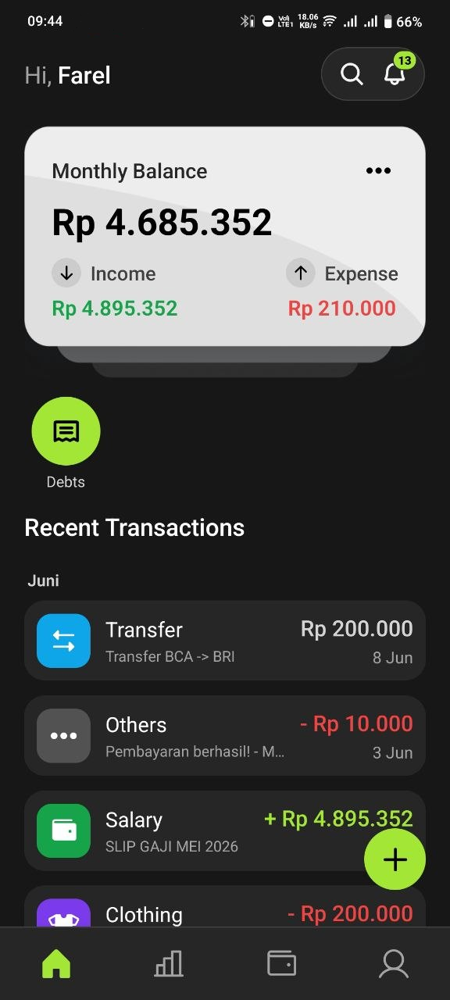
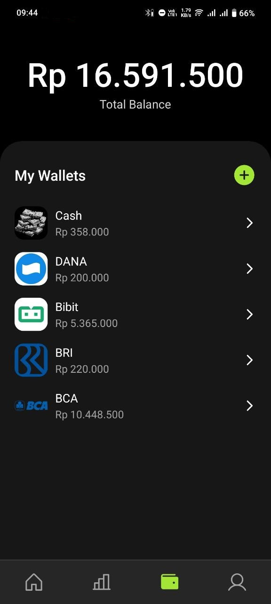
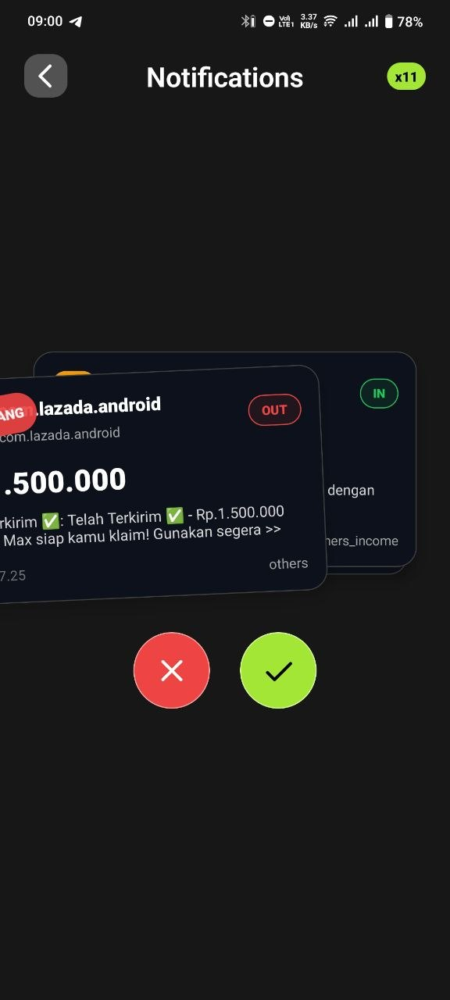
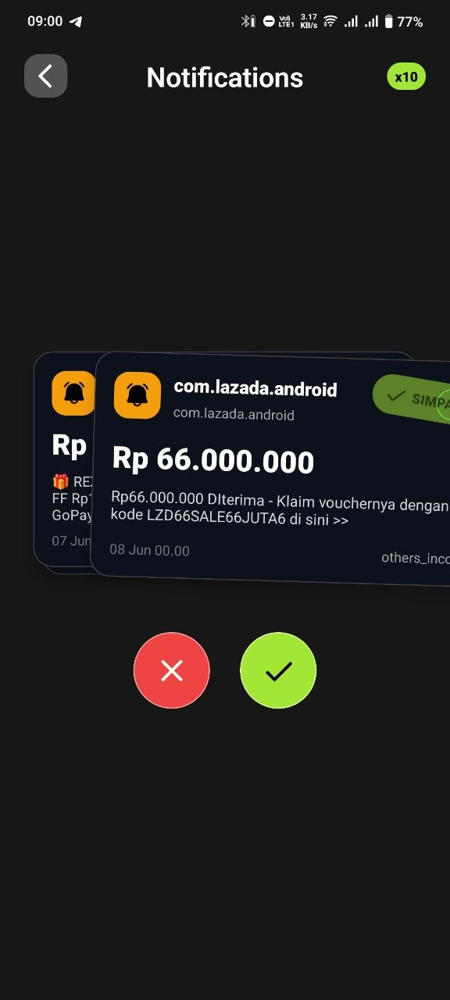

# Fastra

  

  <strong>Personal finance tracker for wallets, transactions, statistics, and Android notification import.</strong>

Fastra is a personal finance tracker built with Expo and React Native. It helps users record transactions, manage wallets, review financial summaries, and optionally import supported Android bank or e-wallet notifications into transaction drafts.

Fastra is built as a portfolio project and a production-oriented first product. The codebase focuses on practical mobile app patterns: authenticated accounts, cloud-backed data, wallet-based balance tracking, financial summaries, and a review-first notification import workflow.

## Preview

| Home | Wallet |
| --- | --- |
|  |  |

| Review Import | Saved Import |
| --- | --- |
|  |  |

## Highlights

- **Wallet management**: track balances across multiple wallets and keep hidden or inactive wallets out of the main view.
- **Transaction tracking**: record income and expenses with categories, dates, notes, and optional images.
- **Notification import**: review supported Android bank and e-wallet notifications before turning them into transactions.
- **Cloud sync**: use Firebase Authentication and Firestore to keep user data connected to signed-in accounts.
- **Statistics**: review income, expenses, category breakdowns, and period-based financial summaries.
- **Personal finance tools**: manage categories, debts, receivables, and transaction history in one app.

## Tech Stack

- Expo SDK 54
- React Native 0.81
- React 19
- TypeScript
- Expo Router
- Firebase Authentication
- Firebase Firestore
- React Native Reanimated
- React Native Gesture Handler
- React Native Gifted Charts
- Android notification listener integration

## Notification Import

Notification import is an optional Android feature. When enabled by the user, Fastra can read supported financial notifications from the device notification listener, parse likely transaction details, and place them into a review flow before they are saved.

This feature is designed as a convenience layer, not as a replacement for user review. Imported data can be incomplete or inaccurate, so the user remains responsible for confirming each transaction.

## Cloud Data

Fastra uses Firebase Authentication and Firestore for signed-in user data. User records, wallets, transactions, categories, settings, and import states are connected to authenticated sessions.

## Contact

- Instagram: [@frelardi_](https://instagram.com/frelardi_)
- Email: [farelasrpl@gmail.com](mailto:farelasrpl@gmail.com)

## License

Fastra is released under the [MIT License](LICENSE).
